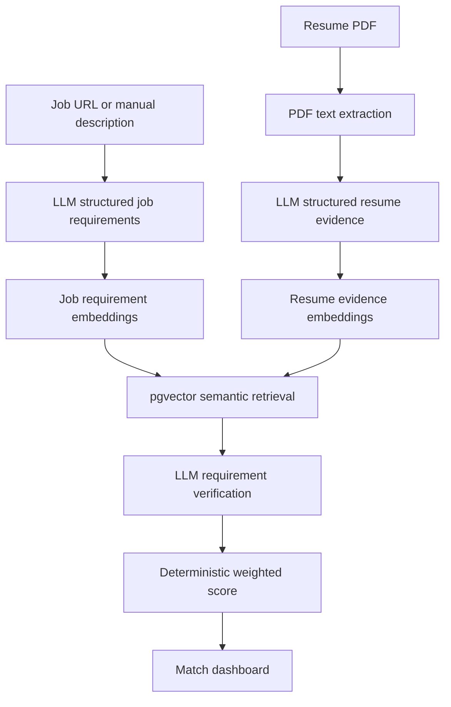

# ApplyAI

ApplyAI is an AI-powered job application assistant that compares a candidate resume with a job description and explains the match.

It extracts structured resume evidence, extracts job requirements, retrieves the most relevant evidence with embeddings, asks an LLM to verify each requirement, and calculates a deterministic compatibility score.

## App

https://apply-ai-navy.vercel.app/

## Demo

Demo login:

```text
username: admin
password: adminapplyai2026
```

The demo workspace includes a sample resume and a sample job. Select the saved job and click `Run Analysis`.

## How to Use

1. Open the app and log in with the demo credentials.
2. Select the saved job.
3. Click `Extract Requirements` to inspect the job requirements.
4. Click `Run Analysis` to compare the job with the demo resume.
5. Review the score, requirement matches, gaps, and supporting evidence.

## AI Pipeline



## What It Uses

- **LLM structured outputs** for resume evidence extraction.
- **LLM structured outputs** for job requirement extraction.
- **Embeddings** with `text-embedding-3-small`.
- **Vector search** with PostgreSQL + `pgvector`.
- **LLM verification** for each requirement using retrieved resume evidence.
- **Deterministic scoring** based on match classification and requirement importance.

## Match Logic

For each job requirement, ApplyAI retrieves the 3 closest resume evidence items using cosine distance.

The LLM classifies the requirement as:

```text
MATCH
PARTIAL
NO_MATCH
```

The final score is calculated by the backend:

```text
MATCH = 1.0
PARTIAL = 0.5
NO_MATCH = 0.0

required = 1.5x
preferred = 1.0x
nice_to_have = 0.5x
unknown = 1.0x
```

## Stack

- **Frontend:** Next.js, TypeScript
- **Backend:** FastAPI, Python, SQLAlchemy, Alembic
- **Database:** PostgreSQL, pgvector
- **AI:** OpenAI Responses API, Structured Outputs, embeddings
- **Deploy:** Vercel, Render, Supabase

## Deployment

- Frontend hosted on Vercel.
- Backend API hosted on Render.
- PostgreSQL + pgvector hosted on Supabase.
